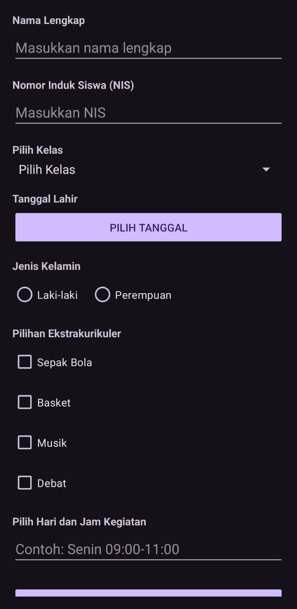

# Extracurricular Registration App


A mobile application for SMA Muhammadiyah students to register for extracurricular activities, built with Android and Kotlin.

## Features

- **Student Information Collection**:
  - Name input
  - NIS (Student ID) input
  - Class selection via Spinner
  - Date of birth picker
  - Gender selection

- **Activity Registration**:
  - Multiple extracurricular selection (Checkboxes)
  - Schedule selection with autocomplete suggestions
  - Form validation

- **Data Submission**:
  - All collected data shown in confirmation screen
  - Proper data passing between activities

## Screenshots

| Form Screen | Confirmation |
|-------------|--------------|
|  |  |

## Technology Stack

- **Language**: Kotlin
- **Minimum SDK**: API 21 (Android 5.0)
- **Architecture**: Single Activity with Multiple Fragments
- **Components**:
  - ScrollView for form layout
  - AutoCompleteTextView for schedule suggestions
  - DatePickerDialog
  - RadioGroups and Checkboxes
  - Intent-based navigation

## Installation

1. Clone the repository:
   ```bash
   git clone https://github.com/dorumon234/Event-Handling-AndroidStudio.git
